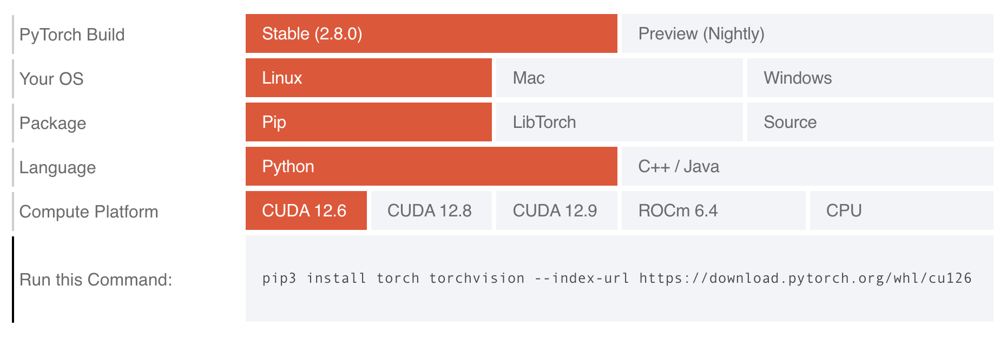

# Setting Up Your Conda Environment


Install miniconda by following the instructions under "Quick command line install" for your operating system here: [https://docs.anaconda.com/miniconda/](https://docs.anaconda.com/miniconda/). 

Create and activate the conda environment for the book:
```
conda create --name book
conda activate book
```

Install PyTorch by selecting the appropriate parameters on this page: [https://pytorch.org](https://pytorch.org). Note that if your computer has a Nvidia GPU, you should select one of the CUDA versions for Compute Platform (ideally, the most recent one). 

For example, for Mac OS, the configuration should look like this:


For a Linux machine with an Nvidia GPU, the configuration should look like this:


Then, run the indicated command. For example, for Macs the command generated is:

```
conda install pytorch::pytorch torchvision torchaudio -c pytorch
```

Lastly, install a few more needed packages:
```
conda install torchtext
conda install pip
conda install jupyter pandas matplotlib scikit-learn gensim nltk
pip install conllu transformers datasets
pip install accelerate -U
```

# Environments in which this Code was Tested

Note that as these libraries evolve you may run into versions that are no longer compatible with this code. To control for this situation, we list below the exact environments that were used to test this code when we wrote the book. You can install any of these using the command `conda env create -f <ENVIRONMENT-NAME>`, e.g., `conda env create -f environment_gpu.yml` to install the environment for a Linux machine with GPU.

- [Linux machine with a GPU](https://github.com/clulab/gentlenlp/blob/main/notebooks/environment_gpu.yml)
- [Linux machine without a GPU](https://github.com/clulab/gentlenlp/blob/main/notebooks/environment_cpu.yml)
- [M1 Mac](https://github.com/clulab/gentlenlp/blob/main/notebooks/environment_mac.yml)

# External Datasets Used 

## Binary Classification

For binary classification we used the [Large Movie Review Dataset](https://ai.stanford.edu/~amaas/data/sentiment/) created by Andrew Maas. Because this dataset allows redistribution, we copied it in this repository at this location: [https://github.com/clulab/gentlenlp/tree/main/notebooks/data/aclImdb](https://github.com/clulab/gentlenlp/tree/main/notebooks/data/aclImdb), which is the location expected by the notebooks that implement binary classifiers. Please see the [dataset's README](https://github.com/clulab/gentlenlp/blob/main/notebooks/data/aclImdb/README) for more details, including the appropriate citation if you use this dataset in research publications. 

## Multiclass Classification

For multiclass classification we used a version of the [AG News dataset](http://groups.di.unipi.it/~gulli/AG_corpus_of_news_articles.html). In particular, we used the simplified form of the dataset from the paper [Character-level Convolutional Networks for Text Classification](https://proceedings.neurips.cc/paper/2015/file/250cf8b51c773f3f8dc8b4be867a9a02-Paper.pdf), which keeps only the four most frequent labels. The license for this dataset does not allow redistribution, so please download the archive `ag_news_csv.tar.gz` yourself from [here](https://drive.google.com/drive/u/0/folders/0Bz8a_Dbh9Qhbfll6bVpmNUtUcFdjYmF2SEpmZUZUcVNiMUw1TWN6RDV3a0JHT3kxLVhVR2M?resourcekey=0-TLwzfR2O-D2aPitmn5o9VQ). Uncompress the downloaded file, and copy the `ag_news_csv` folder under `notebooks/data/` in your repository.

June 2025 update: Note that the current version of the AG News dataset has over 1M articles. In our code we used a version with only 120K examples. Mike Maxwell wrote a Python program that subsets the latest data, splits it into test and train, and converts from the original format into the the programs in this book are expecting. You can download his code [here](https://github.com/clulab/gentlenlp/blob/main/notebooks/DataConverter4MulticlassLearning.py).

## Pre-trained English Word Embeddings

Please download the [these GloVe embeddings](https://nlp.stanford.edu/data/glove.6B.zip) from the [Stanford GloVe website](https://nlp.stanford.edu/projects/glove/). Once the `glove.6B.zip` file is downloaded, uncompress it and place the extracted `glove.6B.300d.txt` file in the `notebooks/` folder.

## Pre-trained Spanish Word Embeddings

Please download the [these Spanish GloVe embeddings](http://dcc.uchile.cl/~jperez/word-embeddings/glove-sbwc.i25.vec.gz) from the [Spanish Word Embeddings GitHub repository](https://github.com/dccuchile/spanish-word-embeddings). Once the `glove-sbwc.i25.vec.gz` file is downloaded, uncompress it and place the extracted `glove-sbwc.i25.vec` file in the `notebooks/` folder.

## Part-of-speech Tagging

For part-of-speech tagging we used the Spanish AnCora dataset that is included in the 
[Universal Dependencies version 2.8 dataset](https://lindat.mff.cuni.cz/repository/xmlui/bitstream/handle/11234/1-3720/deep-ud-2.8-data.tgz?sequence=1&isAllowed=y). Its license does not allow redistribution, so please download the UD version 2.8 dataset from [here](https://lindat.mff.cuni.cz/repository/xmlui/bitstream/handle/11234/1-3720/deep-ud-2.8-data.tgz?sequence=1&isAllowed=y). Uncompress the downloaded `deep-ud-2.8-data.tgz` file, and copy the `UD_Spanish-AnCora` folder under `notebooks/data/` in your repository.


